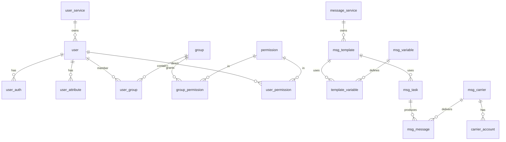

# 微服务数据模型设计（优化版）

> 基于用户管理服务、消息通知服务两张原始 ER 图，按 **user-service / message-service / log-service** 拆分并去跨库外键。  
> 与接口约定见 [API.md](./API.md)。

## 1. 设计原则

| 原则 | 说明 |
|------|------|
| **按服务分库** | 每个微服务独立 schema/数据库，禁止跨服务 DB 级外键 |
| **逻辑关联** | 跨服务仅保存对方 `user_id`、`task_id` 等 ID，通过 API 校验存在性 |
| **日志归 log-service** | 用户 ER 中的 `log`、`user_log` 不落在 user-service |
| **消息归 message-service** | 用户 ER 中孤立的 `msg` 不落在 user-service |
| **凭证与档案分离** | 登录标识放 `user_auth`；`user` 存主体档案 |
| **消息侧不复制用户档案** | message-service 不存 `name/email/phone` 全量表，只存 `receiver` 与 `user_id` |



---

## 2. user-service 数据模型

**库名建议**：`devops_user`（与现有 MySQL `devops` 可同实例不同 schema）

### 2.1 与原图差异

| 原图实体 | 处理 |
|----------|------|
| `user` | 保留并增强审计字段 |
| `user_auth` | 保留；修正字段类型 |
| `attribute` | 重命名为 `user_attribute`，支持扩展 |
| `group`、`user_group`、`permission`、`group_permission`、`user_permission` | 保留 |
| `log`、`user_log` | **移除** → log-service |
| `msg` | **移除** → message-service |

### 2.2 表结构

#### `user`（用户主体）

| 字段 | 类型 | 说明 |
|------|------|------|
| user_id | BIGINT PK | 主键 |
| display_name | VARCHAR(128) | 显示名（原 name） |
| sex | TINYINT NULL | 可选 |
| status | VARCHAR(32) | ACTIVE / LOCKED / DEREGISTERED |
| is_deleted | TINYINT(1) | 逻辑删除 |
| created_at | DATETIME | |
| updated_at | DATETIME | |

> **不再在 user 表存 phone/email/password**：与 md「单一凭证、多登录方式」一致，统一走 `user_auth`。

#### `user_auth`（认证凭证，对应 API 的 credential）

| 字段 | 类型 | 说明 |
|------|------|------|
| auth_id | BIGINT PK | |
| user_id | BIGINT | 逻辑关联 user |
| identity_type | VARCHAR(32) | PHONE / EMAIL / USERNAME / FEISHU / WECHAT |
| identifier | VARCHAR(255) | 手机号、邮箱、openid 等（原 account，改为字符串） |
| secret_hash | VARCHAR(255) NULL | 密码哈希；OAuth 可空 |
| verified | TINYINT(1) | 是否已验证 |
| expired_at | DATETIME NULL | 验证码/令牌过期 |
| created_at | DATETIME | |

**对应接口**：`POST /internal/user/register`、`/internal/user/login` 读写本表。

#### `user_attribute`（扩展属性，原 attribute）

| 字段 | 类型 | 说明 |
|------|------|------|
| attr_id | BIGINT PK | |
| user_id | BIGINT | |
| attr_key | VARCHAR(64) | 原 atr_name |
| attr_value | VARCHAR(512) | 或 JSON；大规模扩展可改 JSONB |

#### `group`

| 字段 | 类型 | 说明 |
|------|------|------|
| group_id | BIGINT PK | |
| name | VARCHAR(255) | |
| description | VARCHAR(255) | |
| creator_user_id | BIGINT | 原 creator |
| is_admin | TINYINT(1) | |
| is_deleted | TINYINT(1) | |
| created_at | DATETIME | |

#### `user_group` / `permission` / `group_permission` / `user_permission`

与原图一致，仅统一：

- 主键：`id` 或 `{表}_id` 二选一（建议关联表用 `id`，主实体用 `{entity}_id`）
- `permission.active` → `TINYINT(1)` 与 `is_admin` 一致

**权限解析（TopBiz 登录后）**：有效权限 = `user_permission` ∪ 用户所属 `group` 的 `group_permission`（去重 `perm_code`）。

### 2.3 与 API 映射

| API（internal） | 主要表 |
|-----------------|--------|
| `/internal/user/register` | user + user_auth |
| `/internal/user/login` | user_auth |
| `/internal/user/{userId}/permissions` | user_permission, group_permission, user_group |
| `/internal/group/*`、`/internal/permission/*` | 同名表 |

---

## 3. message-service 数据模型

**库名建议**：`devops_message`

### 3.1 与原图差异

| 原图实体 | 处理 |
|----------|------|
| `user`（全字段） | **删除**；改为请求中的 `receiver_id` / `receiver` 字符串，不建用户档案表 |
| `userAccount` | 重命名 **`carrier_tenant_binding`**（租户/业务线绑定载体账号），避免与「用户登录账号」混淆 |
| `template` | 重命名 **`msg_template`**，增加 `status`、`channel_type` |
| `variable` | 重命名 **`msg_variable`** |
| `task` | 重命名 **`msg_task`**（即时/定时任务） |
| `message` | 重命名 **`msg_message`**（发送流水，对应 sending-records） |
| `carrier` / `carrier_account` | 保留，对齐 `/internal/msg/carriers` |
| `policy` / `task_policy` | 保留，服务定时/重试策略 |

### 3.2 表结构

#### `msg_template`

| 字段 | 类型 | 说明 |
|------|------|------|
| template_id | BIGINT PK | |
| name | VARCHAR(128) | |
| content | TEXT | 模板正文 |
| channel_type | VARCHAR(32) | **IN_APP / TENCENT_SMS / EMAIL**（选修预留 FEISHU / WECHAT） |
| status | VARCHAR(32) | DRAFT / ACTIVE / DISABLED |
| created_at | DATETIME | |
| updated_at | DATETIME | |

**对应 API**：`/internal/message-templates`；对外 `PUT /api/v1/templates/{id}/status` 更新 `status`。

#### `msg_variable` / `template_variable`

与原图 `variable`、`template_variable` 一致；`scope`：GLOBAL / TEMPLATE。

**对应 API**：`GET /internal/variables/schema`（规划）、`/internal/variables`、`/internal/variables/{variableId}`。

#### `msg_carrier` / `carrier_account`

| msg_carrier | 说明 |
|-------------|------|
| carrier_id PK | |
| name, provider | 通道名称、供应商 |
| channel_type | 与模板一致 |
| config_json | 加密配置（access_key 等） |
| enabled, deleted_at | 软删 |

`carrier_account`：某租户使用的通道账号实例；`carrier_tenant_binding(tenant_id, account_id)` 替代原 `userAccount` 歧义命名。

**对应 API**：`/internal/msg/carriers*`。

#### `msg_task`（原 task）

| 字段 | 类型 | 说明 |
|------|------|------|
| task_id | BIGINT PK | |
| template_id | BIGINT | |
| carrier_account_id | BIGINT NULL | |
| initiator_user_id | BIGINT NULL | **逻辑 ID**，关联 user-service，无 FK |
| receiver | VARCHAR(255) | 手机号/邮箱/userId 等 |
| is_scheduled | TINYINT(1) | |
| scheduled_at | DATETIME NULL | |
| status | VARCHAR(32) | PENDING / SENDING / SUCCESS / FAILED |
| created_at | DATETIME | |

**对应 API**：`/internal/messages/instant`、`/internal/messages/scheduled`。

#### `msg_message`（原 message，即发送记录）

| 字段 | 类型 | 说明 |
|------|------|------|
| message_id | BIGINT PK | |
| task_id | BIGINT | |
| template_id | BIGINT | |
| carrier_id | BIGINT NULL | |
| receiver | VARCHAR(255) | |
| rendered_content | TEXT | |
| status | VARCHAR(32) | |
| provider_msg_id | VARCHAR(128) NULL | 第三方回执 |
| send_time | DATETIME | |
| error_message | VARCHAR(512) NULL | |

**对应 API**：`GET/DELETE /internal/sending-records`（对外 `/api/v1/sending-records`）。

#### 验证码（Redis 为主，可选 MySQL 审计）

| 存储 | Key 模式 | TTL |
|------|----------|-----|
| **Redis** | `verify:email:{scene}:{email}` / `verify:phone:{scene}:{phone}` | 5 分钟 |
| 限流 | `verify:rate:{target}` | 60 秒 |

规范见 [ADR.md](../ADR.md) §5。可选 MySQL `verification_code` 表仅用于离线审计，MVP 不建表。

**对应 API**：`/internal/message/email_code/send`、`/internal/message/phone_code/send`、`/internal/message/verify`。

#### `policy` / `task_policy`

保留；供 `POST /internal/scheduler/trigger` 与定时发送使用。

### 3.3 跨服务关联（仅逻辑）

```
user-service.user.user_id
    ←── msg_task.initiator_user_id（可选）
    ←── log-service.audit_log.user_id
message-service 不查询 user 表；TopBiz 调用前校验 userId / 填 receiver
```

---

## 4. log-service 数据模型

**双存储**（与 [API.md](./API.md) §1.6、[ADR.md](../ADR.md) §6、[logservice.md](../../logservice.md) §4 结构 + §5 行为一致）：

| 数据 | 写入路径 | 存储 |
|------|----------|------|
| 访问日志 | 四服务 `AccessLogInterceptor` → JSON 文件 → Vector | **ClickHouse** `access_log`（表名可团队约定） |
| 业务审计 | TopBiz → `POST /internal/log/record` | **MySQL** `devops_log.audit_log` |

### 4.1 与原图差异

| 原图（在 user 库中） | 处理 |
|---------------------|------|
| `log` + `user_log` | 业务审计合并为 **`audit_log`**；HTTP 明细进 ClickHouse，不再与审计混表 |

### 4.2 ClickHouse：`access_log`（访问/运维）

由拦截器 JSON 入库；字段与 logservice **§4 snake_case** 对齐（§5.1 camelCase 样例不采用）：

| 字段 | 类型 | 说明 |
|------|------|------|
| trace_id | String | |
| service_name | LowCardinality(String) | `topbiz` / `user` / `message` / `log` |
| client_ip | String | |
| method | String | HTTP 方法 |
| uri | String | 含 `/api/v1/*` 与 `/internal/*` |
| cost_ms | UInt32 | |
| http_status | UInt16 | |
| biz_code | String | 业务 code，如 `0` |
| timestamp | DateTime64 | |
| req_params | String | 脱敏 JSON；记录策略见 ADR §6.2 |
| res_body | String | 脱敏 JSON；可 `body-on-error-only` |
| level | LowCardinality(String) NULL | 可选，拦截器输出时写入 |

查询：`GET /internal/log/ops/query`；指标：`GET /internal/log/metrics`（查询时聚合，§3.7）。

### 4.4 `metrics_aggregate`（选修，logservice §2.3）

定时任务（如每 5 分钟）从 `access_log` 预计算写入，供大屏/即时查询。

| 字段 | 类型 | 说明 |
|------|------|------|
| window_start | DateTime | 统计窗口起点 |
| service_name | String | |
| uri | String | api |
| pv | UInt64 | |
| qps | Float64 | |
| error_rate | Float64 | |
| p95 | UInt32 | |
| p99 | UInt32 | |
| success_rate | Float64 | |
| ip_risk_score | Float64 NULL | 安全 §2.3 |

### 4.5 `metrics_threshold_config`（选修，logservice §1.3）

| 字段 | 类型 | 说明 |
|------|------|------|
| config_key | VARCHAR PK | 如 `error_rate_max` |
| threshold_value | DOUBLE | |
| severity | VARCHAR | NORMAL / WARN / CRITICAL |
| updated_at | DATETIME | |

供 §2.4 WebSocket 阈值判定；REST 见 API.md §5.4.1。

### 4.3 MySQL：`audit_log`（业务审计）

对应 `POST /internal/log/record`、`GET /internal/log/{userId}/query`、对外 `GET /api/v1/log`。

| 字段 | 类型 | 说明 |
|------|------|------|
| log_id | BIGINT PK | |
| trace_id | VARCHAR(64) | |
| user_id | BIGINT NULL | 操作人 |
| operation | VARCHAR(64) | `USER_REGISTER`、`USER_LOGIN`、`ADMIN_USER_DELETE` 等 |
| success | TINYINT(1) | |
| target_id | VARCHAR(64) NULL | 可选 |
| detail | TEXT NULL | 脱敏摘要 |
| created_at | DATETIME | |

> 审计表**不必**重复存 `uri`/`cost_ms`（访问明细在 ClickHouse）；若需关联，用 `trace_id` 关联 `access_log`。

---

## 5. 原图问题与优化对照

| 问题 | 优化 |
|------|------|
| user 库含 `msg` | 移至 message-service |
| user 库含 `log`/`user_log` | 移至 log-service |
| message 库含完整 `user` 表 | 改为 `initiator_user_id` + `receiver` 逻辑引用 |
| `userAccount` 命名歧义 | 改为 `carrier_tenant_binding` |
| `user_auth.account`/`secret` 为 bigint | 改为 `identifier` VARCHAR、`secret_hash` VARCHAR |
| `user` 同时存 phone/email 与 user_auth 重复 | 凭证只进 user_auth |
| 跨服务 ER 连线 | 文档级逻辑 ID，禁止跨库 FK |
| template_id 在 task 与 message 重复 | 保留冗余便于流水查询，以 task 为准 |

---

## 6. 与 TopBiz / API 的一致性

课程必做范围见 [API.md](./API.md) §1.5（用户 6 场景、消息 IN_APP / TENCENT_SMS / EMAIL）。

| 能力 | 数据落点 | TopBiz 对外 API |
|------|----------|-----------------|
| 注册/登录（凭证+密码/邮箱/手机） | user_auth、verification_code | `/api/v1/register*`、`/api/v1/login*`（含 `login/phone_code`） |
| RBAC 管理 | group/permission 等 | `/api/v1/admin/*` |
| 用户审计历史 | audit_log（MySQL） | `GET /api/v1/log` |
| 运维/访问日志检索 | access_log（ClickHouse） | `GET /api/v1/log/ops/query` |
| 日志指标 | access_log 查询时聚合 | `GET /api/v1/log/metrics` |
| 指标阈值配置（选修） | metrics_threshold_config | `GET/PUT /api/v1/log/metrics/config` |
| 预聚合指标（选修） | metrics_aggregate | 无对外 REST；§2.3 自驱 |
| WebSocket 监控（选修） | metrics_aggregate + config | logservice §2.4 |
| 模板/变量/载体 | msg_* | `/api/v1/templates`、`variables`、`msg/carriers` |
| 发送/记录 | msg_task、msg_message | `/api/v1/send/*`、`sending-records` |
| 审计写入 | audit_log | TopBiz 成功后 `POST /internal/log/record`（非每次 HTTP） |
| 访问日志采集 | access_log | 四服务拦截器 + Vector，**无** REST 写入 |

---

## 7. 相关文档

- [API.md](./API.md) — 接口与编排
- [GAPS.md](./GAPS.md) — 未定义 API（如 user_permission 独立 CRUD）
