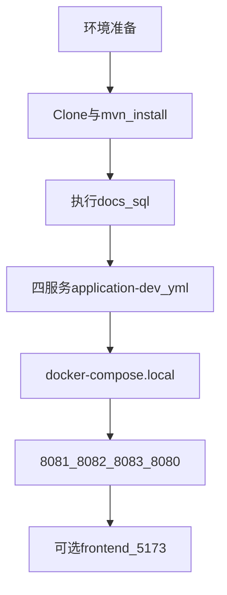

# SpringBoot_DevOps

2026春-SpringBoot微服务设计与DevOps实践

**当前里程碑：[v0.2.0](CHANGELOG.md)** — Log 域 + Spring Session Redis + 本地 CH/Vector 开发链路。变更见 [CHANGELOG.md](./CHANGELOG.md) 与 [变更汇总.md](./docs/变更汇总.md)。

## 从零启动

面向 **第一次 clone 仓库** 的本地 IDE 开发。SMTP 细节、FAQ、Git 提交规范见 **[开发指南 DEVELOPMENT.md](./docs/DEVELOPMENT.md)**。

### 环境准备

| 类别 | 需要准备 |
|------|----------|
| **本机工具** | JDK 17+、Maven 3.8+、Git、Docker Desktop（ClickHouse + Vector）、Node.js 18+（仅演示前端） |
| **云端 MySQL** | 主机 / 账号 / 密码（向组长索取）；需能创建 3 个库 |
| **云端 Redis** | 主机 / 密码（TopBiz Session + message 验证码） |
| **可选** | QQ 邮箱 SMTP 授权码（message 发邮件；仅站内信可不配） |

**架构分工**：MySQL / Redis 用**云端**；ClickHouse / Vector 用**本机 Docker**；对外只访问 **topbiz :8080**（8081–8083 为内部服务）。



### 启动步骤（0 → 7）

#### 0. Clone 仓库

```powershell
git clone <仓库地址> SpringBoot_DevOps
cd SpringBoot_DevOps
```

Linux / macOS 路径示例：`~/SpringBoot_DevOps`（后续命令相同，仅改路径）。

#### 1. 编译

在**仓库根目录**执行：

```powershell
mvn clean install
```

#### 2. 初始化数据库（云端 MySQL）

在 MySQL 客户端按顺序执行 [`docs/sql/`](docs/sql/) 脚本：

| 顺序 | 脚本 | 说明 |
|------|------|------|
| 1 | [`02_devops_user.sql`](docs/sql/02_devops_user.sql) | 创建 `devops_user` 库及表 |
| 2 | [`02b_user_rbac_seed.sql`](docs/sql/02b_user_rbac_seed.sql) | RBAC 种子数据 |
| — | [`02a_user_rbac_migrate.sql`](docs/sql/02a_user_rbac_migrate.sql) | **已有旧库**时先执行，再跑 02b |
| 3 | [`03_devops_message.sql`](docs/sql/03_devops_message.sql) | 创建 `devops_message`（含欢迎站内信模板 `templateId=1`） |
| 4 | [`01_devops_log.sql`](docs/sql/01_devops_log.sql) | 创建 `devops_log`（审计表、指标阈值） |

ClickHouse 表由步骤 4 的 local compose 自动初始化（`04_clickhouse_access_log.sql`、`05_clickhouse_metrics_aggregate.sql`）；手动执行见 [DEVELOPMENT.md §4.4](./docs/DEVELOPMENT.md)。

**Admin 演示**：首个注册用户 `userId=1` 自动为 admin，可访问日志域 / 管理域。

表结构详见 [DATA_MODEL.md](./docs/DATA_MODEL.md)。

#### 3. 复制并填写本地配置

各服务 `src/main/resources/` 下，将 `application-dev-example.yml` 复制为 **`application-dev.yml`**（已在 `.gitignore`，**勿提交密码**）：

| 服务 | 模板路径 | 要点 |
|------|----------|------|
| user-service | `user-service/src/main/resources/application-dev-example.yml` | MySQL → `devops_user` |
| message-service | `message-service/src/main/resources/application-dev-example.yml` | MySQL → `devops_message` + Redis + SMTP（可选） |
| log-service | `log-service/src/main/resources/application-dev-example.yml` | MySQL → `devops_log` + ClickHouse `localhost:8123` |
| topbiz | `topbiz/src/main/resources/application-dev-example.yml` | Redis + 内部服务 URL（默认 localhost:8081–8083） |

将模板占位符 `your_mysql_host`、`your_username`、`your_password`、`your_redis_host` 等替换为真实值（向组长索取）。

QQ 邮箱 SMTP 配置示例见 [DEVELOPMENT.md §4.6](./docs/DEVELOPMENT.md)。

#### 4. 启动本机 Docker（仅 ClickHouse + Vector）

```powershell
cd infra
docker compose -f docker-compose.local.yml up -d
```

**不要**同时启动全栈 compose 里的本地 mysql / redis（会与云端 3306 / 6379 冲突）。若曾启动过，可执行：

```powershell
docker compose stop mysql redis
```

#### 5. 启动 Java 服务

**必须在各服务模块目录下**执行 `mvn spring-boot:run`（访问日志 `output-dir: ../shared-logs/access` 才会写入仓库根 `shared-logs/`，供 Vector 采集）。

| 顺序 | 目录 | 端口 | 开终端 |
|------|------|------|--------|
| 1 | `user-service` | 8081 | 终端 1 |
| 2 | `message-service` | 8082 | 终端 2 |
| 3 | `log-service` | 8083 | 终端 3 |
| 4 | `topbiz` | 8080 | 终端 4 |

**端口占用排查**（Windows）：

```powershell
netstat -ano | findstr :8080
taskkill /PID <pid> /F
```

#### 6. （可选）演示前端

需步骤 5 四服务均已启动：

```powershell
cd frontend
npm install
npm run dev
```

浏览器打开 **http://localhost:5173**。Vite 将 `/api` 代理至 TopBiz `:8080`。

#### 7. 验证

- 注册 / 登录：见下方 [测试示例](#测试示例)，或使用前端「账号」页
- 首个注册用户登录后可测试「日志」「管理」域（admin）
- 运维日志写入 ClickHouse 需 Vector 容器运行且各服务在模块目录启动

---

## 文档说明

| 文档 | 说明 |
|------|------|
| [DEVELOPMENT.md](./docs/DEVELOPMENT.md) | **协作者上手（推荐先读）** |
| [API.md](./docs/API.md) | 统一接口规格 |
| [ADR.md](./docs/ADR.md) | 技术决策记录 |
| [DATA_MODEL.md](./docs/DATA_MODEL.md) | 数据模型设计 |
| [GAPS.md](./docs/GAPS.md) | 文档与实现缺口 |
| [COLLABORATION.md](./docs/COLLABORATION.md) | 分工与协作 |
| [变更汇总.md](./docs/变更汇总.md) | 本阶段代码/配置变更与测试要点 |
| [CHANGELOG.md](./CHANGELOG.md) | 版本发布记录 |

## 目录说明：infra / shared-logs / logs

| 目录 | 作用 | 何时使用 |
|------|------|----------|
| [infra/](./infra/) | `docker-compose.yml`（全栈）、**`docker-compose.local.yml`（推荐本地：仅 CH+Vector）**、[vector/vector.toml](./infra/vector/vector.toml) | 本地起 ClickHouse/Vector；或一键 Docker 部署全服务 |
| [shared-logs/](./shared-logs/) | IDE 开发：四服务写入仓库根 `shared-logs/access/{serviceName}/` | local compose 挂载给 Vector |
| [logs/](./logs/) | Docker 全栈：容器内 `logs/access/{serviceName}/`，compose 卷 `access_logs` 与 Vector 共享 | 全服务跑在 Docker 时使用 |

**数据流（IDE + local compose）**：

```
各模块 mvn spring-boot:run → shared-logs/access/{service}/access-*.jsonl
                            → Vector → ClickHouse
```

**数据流（全栈 Docker）**：

```
四 Java 容器 → access_logs 卷 → Vector → ClickHouse
```

Vector 是 infra 独立容器；log-service 只**查询** ClickHouse，不负责采集。

## 配置文件说明

| 文件 | 说明 |
|------|------|
| `application.yml` | 公共配置，指定激活 profile |
| `application-dev.yml` | 本地开发（**.gitignore，勿提交**） |
| `application-dev-example.yml` | 配置模板 |
| `application-docker.yml` | Docker / K8s 容器内配置 |

### 内部服务调用（dev / docker / K8s）

| 环境 | topbiz → 内部服务 | 内部鉴权 |
|------|-------------------|----------|
| IDE 本地 | `http://localhost:8081` 等 | dev profile 可跳过 token |
| Docker Compose | `http://user-service:8081` 等 | `DEVOPS_INTERNAL_TOKEN` |
| Kubernetes | ClusterIP | Secret `DEVOPS_INTERNAL_TOKEN` |

对外**仅暴露 topbiz 8080**（Compose）或 Ingress（K8s）。

## Docker 全栈部署（Compose）

```powershell
# 仓库根目录先打包
mvn clean package -DskipTests
cd infra
docker compose up -d --build
```

生产建议叠加 overlay：

```powershell
docker compose -f docker-compose.yml -f docker-compose.prod.yml up -d
```

详见 [DEVELOPMENT.md §10](./docs/DEVELOPMENT.md#10-docker-与-kubernetes-部署)。

## Kubernetes 集群部署

清单位于 [infra/k8s/](infra/k8s/README.md)。仅 topbiz 通过 Ingress 对外。

```bash
kubectl apply -f infra/k8s/namespace.yaml
kubectl apply -f infra/k8s/configmap-app.yaml
cp infra/k8s/secret-app.yaml.example infra/k8s/secret-app.yaml  # 编辑后 apply
kubectl apply -R -f infra/k8s/
```

## 测试示例

对外接口统一走 TopBiz（8080）。请求体见 [API.md §1.5](./docs/API.md)。

### 注册

**Windows（PowerShell）**：

```powershell
@'
{"credentialType":"PHONE","credential":"13800000001","password":"123456"}
'@ | Set-Content -Encoding utf8 register.json

curl.exe -X POST "http://localhost:8080/api/v1/register" -H "Content-Type: application/json" -d "@register.json"
```

**Linux / Git Bash**：

```bash
curl -X POST "http://localhost:8080/api/v1/register" \
  -H "Content-Type: application/json" \
  -d '{"credentialType":"PHONE","credential":"13800000001","password":"123456"}'
```

### 登录

```powershell
curl.exe -X POST "http://localhost:8080/api/v1/login" -H "Content-Type: application/json" -d "@register.json"
```

登录成功后响应头含 `Set-Cookie: JSESSIONID=...`，后续请求需携带 Cookie。

### 管理员（运维日志查询）

**admin 判定**：`userId=1` 或 `identifier=admin`。详见 [GAPS.md §2](./docs/GAPS.md)。

```powershell
curl.exe -X POST "http://localhost:8080/api/v1/log/ops/query" `
  -H "Content-Type: application/json" `
  -H "Cookie: JSESSIONID=<从登录响应复制>" `
  -d '{"page":1,"size":10}'
```

需 log-service（8083）已启动；非 admin 返回 403。

## 提交到 GitHub

提交前请阅读 **[DEVELOPMENT.md §9](./docs/DEVELOPMENT.md#9-提交到-github)**。摘要：

- **可提交**：源码、`application-dev-example.yml`、`docs/`、`infra/`、`shared-logs/access/.gitkeep`
- **勿提交**：`**/application-dev.yml`、`target/`、`.idea/`、`shared-logs/**/*.jsonl`

## 数据库存储

| 库 | 脚本 | 主要表 |
|----|------|--------|
| `devops_user` | [`docs/sql/02_devops_user.sql`](docs/sql/02_devops_user.sql) + [`02b_user_rbac_seed.sql`](docs/sql/02b_user_rbac_seed.sql) | `user`、`user_auth`、RBAC 相关 |
| `devops_message` | [`docs/sql/03_devops_message.sql`](docs/sql/03_devops_message.sql) | `msg_carrier`、`msg_template`、`msg_message` |
| `devops_log` | [`docs/sql/01_devops_log.sql`](docs/sql/01_devops_log.sql) | `audit_log`、`metrics_threshold_config` |
| ClickHouse | compose 自动 / [`04`](docs/sql/04_clickhouse_access_log.sql)、[`05`](docs/sql/05_clickhouse_metrics_aggregate.sql) | `access_log`、`metrics_aggregate` |

欢迎信 `templateId=1` / `channelType=IN_APP` 由 topbiz 配置 `devops.messaging.welcome` 指定，勿在业务代码硬编码。

完整 ER 与字段说明见 [DATA_MODEL.md](./docs/DATA_MODEL.md)。
