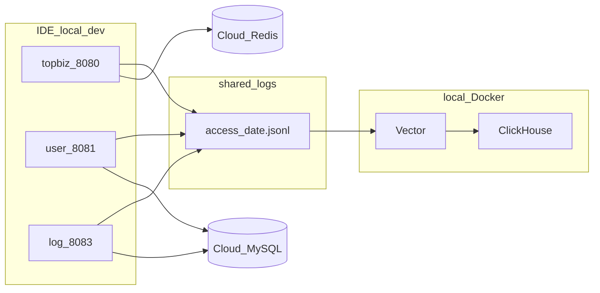

# 开发指南

> 面向 clone 仓库后继续开发的协作者。  
> **当前里程碑：v0.2.0**（详见 [CHANGELOG.md](../CHANGELOG.md)）

## 1. 阅读顺序

| 顺序 | 文档 | 用途 |
|------|------|------|
| 1 | [README.md](../README.md) | 项目概览、目录、快速启动 |
| 2 | **本文 DEVELOPMENT.md** | 环境、配置、联调、提交规范 |
| 3 | [API.md](./API.md) | 接口路径与编排 |
| 4 | [ADR.md](./ADR.md) | 技术决策（Session、日志、Redis Key） |
| 5 | [GAPS.md](./GAPS.md) | 尚未实现的功能 |
| 6 | [变更汇总.md](./变更汇总.md) | 本阶段代码改动与修复记录 |
| 7 | [COLLABORATION.md](./COLLABORATION.md) | 三人分工与优先级 |

## 2. 环境要求

| 工具 | 版本 | 用途 |
|------|------|------|
| JDK | 17+ | Spring Boot 3 |
| Maven | 3.8+ | 多模块构建 |
| Docker Desktop | 最新稳定版 | 本地 ClickHouse + Vector |
| Git | 任意 | 版本管理 |
| Postman 或 curl | - | 接口测试 |

## 3. 架构与数据流（本地 IDE 开发）



- **对外只访问 TopBiz（8080）**；8081–8083 为内部服务。
- **MySQL / Redis**：团队共用云端实例（地址与密码**向组长索取**，写入本地 `application-dev.yml`）。
- **ClickHouse / Vector**：每人本机 Docker，不占用云端资源。

## 4. 首次配置（逐步）

### 4.1 Clone 与编译

```powershell
git clone <仓库地址> SpringBoot_DevOps
cd SpringBoot_DevOps
mvn clean install
```

### 4.2 复制配置模板

以下三个文件**必须**各自复制为 `application-dev.yml`（已在 `.gitignore`，不会进 Git）：

| 服务 | 复制操作 |
|------|----------|
| user-service | `application-dev-example.yml` → `application-dev.yml` |
| topbiz | `application-dev-example.yml` → `application-dev.yml` |
| log-service | `application-dev-example.yml` → `application-dev.yml` |

将模板中的占位符替换为真实值：

| 占位符 | 说明 |
|--------|------|
| `your_mysql_host` | 云端 MySQL 主机（向组长索取） |
| `your_username` / `your_password` | 数据库账号 |
| `your_redis_host` / `your_redis_password` | TopBiz Session 用 Redis |

**切勿**把真实密码提交到 GitHub。

### 4.3 初始化数据库

按 [docs/sql/](./sql/) 脚本在云端 MySQL 创建库表：

- `devops_user`：用户与认证（见 README 或 `00_docker_mysql_init.sql`）
- `devops_log`：审计表（`01_devops_log.sql`）
- ClickHouse：本机 Docker 启动后由 `clickhouse-init` 或 `04_clickhouse_access_log.sql` 初始化

### 4.4 启动 Docker（仅 CH + Vector）

```powershell
cd infra
docker compose -f docker-compose.local.yml up -d
```

**不要**同时启动 compose 里的本地 mysql/redis（会与云端 3306/6379 冲突）。

### 4.5 启动 Java 服务

**必须在各服务模块目录下**执行 `mvn spring-boot:run`（访问日志相对路径 `shared-logs/access` 以进程工作目录为基准）：

| 顺序 | 目录 | 端口 |
|------|------|------|
| 1 | `user-service` | 8081 |
| 2 | `message-service` | 8082 |
| 3 | `log-service` | 8083 |
| 4 | `topbiz` | 8080 |

## 5. 访问日志路径

| 场景 | 路径 |
|------|------|
| IDE 本地开发 | `shared-logs/access/{serviceName}/access-{date}.jsonl` |
| Docker 全栈 | 容器内 `logs/access/{serviceName}/...` |

配置项：`devops.access-log.output-dir`（已提交的配置为相对路径 `shared-logs/access`）。

**不要**在已提交的 yml 里写 `D:/xxx` 这类绝对路径，否则他人 clone 后日志会写到错误位置。

## 6. 接口联调

### 6.1 注册与登录

请求体（[API.md §1.5](./API.md)）：

```json
{
  "credentialType": "PHONE",
  "credential": "13800000001",
  "password": "123456"
}
```

Windows 示例见 [README.md §测试示例](../README.md#测试示例)。

### 6.2 管理员（admin）

dev 环境最小判定（[GAPS.md §2](./GAPS.md)）：

- 第一个注册用户 `userId=1` 自动为 admin，或
- `user_auth.identifier = admin`

登录后保存 Cookie `JSESSIONID`，调用需 admin 的接口（如 `POST /api/v1/log/ops/query`）时在 Header 携带。

### 6.3 最小验收清单

- [ ] 注册返回 `code: 0`
- [ ] 重复注册返回 `code: 409`（不是嵌套在 `data` 里的 0）
- [ ] 登录后 Redis 存在 `shiro:session:*` key
- [ ] `shared-logs/access/topbiz/` 下生成 jsonl 文件
- [ ] admin 可调用 `POST /api/v1/log/ops/query`

## 7. 常见问题

| 现象 | 可能原因 | 处理 |
|------|----------|------|
| 8080/8081 端口被占用 | 旧进程未退出 | `netstat -ano \| findstr :8080` 后 `taskkill /PID <pid> /F` |
| TopBiz 注册 500 | Redis 未配置或连不上 | 检查 `topbiz/application-dev.yml` 中 Redis |
| user-service 启动失败 `ddlApplicationRunner` | MyBatis-Plus 版本不对 | 使用 `mybatis-plus-spring-boot3-starter` 3.5.7 |
| 日志文件未生成 | 工作目录不对 | 在**模块目录**下 `mvn spring-boot:run`，勿在仓库根目录启动 |
| Vector 无数据 | shared-logs 未挂载或路径不对 | 确认 `docker-compose.local.yml` 已 up，且 jsonl 在 `shared-logs/access/` |
| 非 admin 调 log 接口 403 | 正常 | 使用 admin 账号登录 |

## 8. Git 分支与提交规范

见 [COLLABORATION.md §3.3](./COLLABORATION.md)：

- 分支：`feature/topbiz-message`、`feature/user-service`、`feature/log-service`
- 提交前缀：`feat:` / `fix:` / `docs:` / `refactor:`

---

## 9. 提交到 GitHub

### 9.1 应提交的内容

```
README.md  CHANGELOG.md  .gitignore  pom.xml
docs/
common/  topbiz/  user-service/  message-service/  log-service/
infra/  docs/sql/
shared-logs/access/.gitkeep
```

### 9.2 禁止提交

| 路径 | 原因 |
|------|------|
| `**/application-dev.yml` | 含密码（已在 .gitignore） |
| `**/target/` | Maven 编译产物 |
| `.idea/`、`*.iml` | IDE 配置 |
| `shared-logs/**/*.jsonl` | 运行时访问日志 |
| `logs/` | Docker 运行时日志 |

### 9.3 提交前自检

```powershell
cd <项目根目录>
git status
git diff --stat
```

确认 `git status` 中**没有**：

- `application-dev.yml`
- `target/` 目录
- `.jsonl` 文件
- 真实 IP/密码出现在即将提交的 diff 里

### 9.4 推荐命令（首次大提交 v0.2.0）

```powershell
git add README.md CHANGELOG.md .gitignore pom.xml docs/ common/ topbiz/ user-service/ message-service/ log-service/ infra/ shared-logs/

git commit -m "feat: log pipeline, Spring Session Redis, and v0.2.0 dev docs"

git push origin HEAD

git tag -a v0.2.0 -m "Log domain + Session Redis milestone"
git push origin v0.2.0
```

若当前不在 `main` 分支，先 push 功能分支并在 GitHub 上开 Pull Request，合并后再打 tag。
