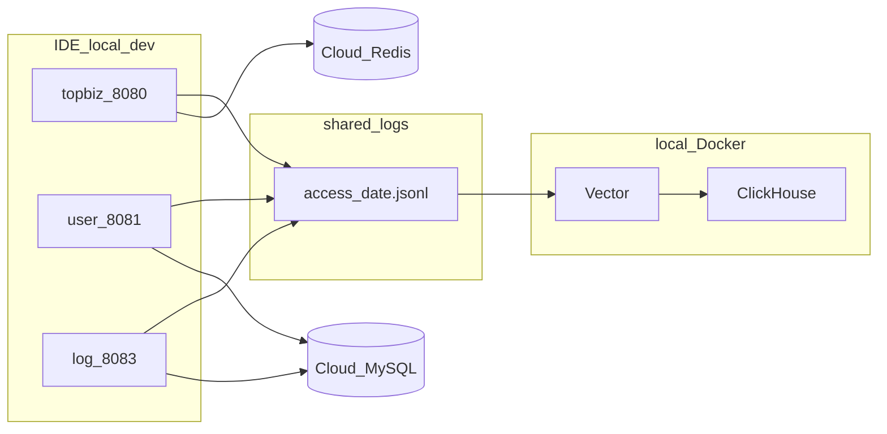

# 开发指南

> 面向 clone 仓库后继续开发的协作者。  
> **当前里程碑：v0.2.0**（详见 [CHANGELOG.md](../CHANGELOG.md)）

## 1. 阅读顺序

| 顺序 | 文档 | 用途 |
|------|------|------|
| 1 | [README.md](../README.md) | 项目概览、目录、快速启动 |
| 2 | **本文 DEVELOPMENT.md** | 环境、配置、联调、提交规范 |
| 3 | [API.md](./API.md) | 接口路径与编排 |
| 4 | [ADR.md](./ADR.md) | 技术决策（Session、日志、Redis Key） |
| 5 | [GAPS.md](./GAPS.md) | 尚未实现的功能 |
| 6 | [变更汇总.md](./变更汇总.md) | 本阶段代码改动与修复记录 |
| 7 | [COLLABORATION.md](./COLLABORATION.md) | 三人分工与优先级 |

## 2. 环境要求

| 工具 | 版本 | 用途 |
|------|------|------|
| JDK | 17+ | Spring Boot 3 |
| Maven | 3.8+ | 多模块构建 |
| Docker Desktop | 最新稳定版 | 本地 ClickHouse + Vector |
| Git | 任意 | 版本管理 |
| Node.js | 18+ | 演示前端（Vite） |
| Postman 或 curl | - | 接口测试（或使用演示前端） |

## 3. 架构与数据流（本地 IDE 开发）



- **对外只访问 TopBiz（8080）**；8081–8083 为内部服务。
- **MySQL / Redis**：团队共用云端实例（地址与密码**向组长索取**，写入本地 `application-dev.yml`）。
- **ClickHouse / Vector**：每人本机 Docker，不占用云端资源。

## 4. 首次配置（逐步）

### 4.1 Clone 与编译

```powershell
git clone <仓库地址> SpringBoot_DevOps
cd SpringBoot_DevOps
mvn clean install
```

### 4.2 复制配置模板

以下三个文件**必须**各自复制为 `application-dev.yml`（已在 `.gitignore`，不会进 Git）：

| 服务 | 复制操作 |
|------|----------|
| user-service | `application-dev-example.yml` → `application-dev.yml` |
| topbiz | `application-dev-example.yml` → `application-dev.yml` |
| log-service | `application-dev-example.yml` → `application-dev.yml` |

将模板中的占位符替换为真实值：

| 占位符 | 说明 |
|--------|------|
| `your_mysql_host` | 云端 MySQL 主机（向组长索取） |
| `your_username` / `your_password` | 数据库账号 |
| `your_redis_host` / `your_redis_password` | TopBiz Session 用 Redis |

**切勿**把真实密码提交到 GitHub。

### 4.3 初始化数据库

按 [docs/sql/](./sql/) 脚本在云端 MySQL 创建库表：

- `devops_user`：用户与认证（见 README 或 `00_docker_mysql_init.sql`）
  - 新库：`02_devops_user.sql` → `02b_user_rbac_seed.sql`
  - **已有库**（缺 `user_permission.status` 等列）：`02a_user_rbac_migrate.sql` → `02b_user_rbac_seed.sql`
- `devops_message`：消息载体/模板/发送流水（`03_devops_message.sql`，含注册欢迎站内信模板 `templateId=1`）
- `devops_log`：审计表（`01_devops_log.sql`）
- ClickHouse：本机 Docker 启动后由 `clickhouse-init` 或 `04_clickhouse_access_log.sql` 初始化

注册成功后会自动加入 `member` 组（继承基础权限）；首个用户 `userId=1` 额外加入 `admin` 组。

### 4.4 启动 Docker（仅 CH + Vector）

```powershell
cd infra
docker compose -f docker-compose.local.yml up -d
```

**不要**同时启动 compose 里的本地 mysql/redis（会与云端 3306/6379 冲突）。

### 4.5 启动 Java 服务

**必须在各服务模块目录下**执行 `mvn spring-boot:run`。访问日志 `output-dir` 为 **`../shared-logs/access`**（相对模块目录 → 仓库根 `shared-logs/access/`），**不要**使用 `shared-logs/access`（否则会写到 `topbiz/shared-logs/` 等子目录，Vector 读不到）。

| 顺序 | 目录 | 端口 |
|------|------|------|
| 1 | `user-service` | 8081 |
| 2 | `message-service` | 8082 |
| 3 | `log-service` | 8083 |
| 4 | `topbiz` | 8080 |

### 4.6 message-service 本地配置（MySQL + Redis + QQ 邮箱）

1. 复制模板并填入真实值（**勿提交 Git**）：

```powershell
cd message-service/src/main/resources
copy application-dev-example.yml application-dev.yml
```

2. 在云端 MySQL 执行 [`docs/sql/03_devops_message.sql`](./sql/03_devops_message.sql)，创建 `devops_message` 库及表；脚本已插入欢迎站内信模板 `templateId=1`（注册后 IN_APP 消息依赖此记录）。

3. `application-dev.yml` 需配置三块：

| 块 | 说明 |
|----|------|
| `spring.datasource` | 云端 `devops_message` 库（与 user-service 同主机） |
| `spring.data.redis` | 与 topbiz 共用 Redis（验证码存 Redis） |
| `spring.mail` + `devops.mail.from` | QQ 邮箱 SMTP |

**QQ 邮箱 SMTP 示例**（`password` 填 **SMTP 授权码**，在 QQ 邮箱 → 设置 → 账户 → 开启 SMTP 后生成；不是 QQ 登录密码）：

```yaml
spring:
  mail:
    host: smtp.qq.com
    port: 465
    username: your_email@qq.com
    password: your_smtp_auth_code
    default-encoding: UTF-8
    properties:
      mail:
        smtp:
          auth: true
          ssl:
            enable: true
          socketFactory:
            class: javax.net.ssl.SSLSocketFactory
            port: 465
        debug: false   # 本地排查时可 true

devops:
  mail:
    from: your_email@qq.com   # 发件人，需与 username 一致或已授权
```

4. 验证邮件链路（需先登录 topbiz 获取 Cookie，或直接调 message-service 内部接口）：

- 注册验证码：`POST /api/v1/register` 仅传 `{ "email": "..." }` → 收件箱应收到 6 位验证码
- 载体测试：`POST /api/v1/msg/carriers/{id}/test`，body `{"testTo":"收件邮箱"}`
- 即时邮件：创建 EMAIL 模板（status=ACTIVE）后 `POST /api/v1/send/instant`

Docker 全栈时 mail 走环境变量 `SPRING_MAIL_*` / `DEVOPS_MAIL_FROM`（见 `message-service/application-docker.yml`）。

## 5. 访问日志路径

| 场景 | `output-dir` 配置 | 实际文件位置 |
|------|-------------------|--------------|
| IDE 本地（dev） | `../shared-logs/access` | 仓库根 `shared-logs/access/{serviceName}/access-{date}.jsonl` |
| Docker 全栈（docker profile） | `logs/access` | 容器内 `/app/logs/access/{serviceName}/...`，与 Vector 共享卷 `access_logs` |

**常见错误**：在 `topbiz/` 下启动却配置 `output-dir: shared-logs/access` → 日志落到 `topbiz/shared-logs/`，Vector 挂载的是仓库根 `shared-logs/access`，ClickHouse 无数据。

**全栈 Docker**：四 Java 服务与 Vector 挂载**同一命名卷** `access_logs`；topbiz 写入卷内文件，Vector tail 同一卷，**不需要** log-service 去「读 topbiz 容器」。

## 6. 接口联调

### 6.1 注册与登录

请求体（[API.md §1.5](./API.md)）：

```json
{
  "credentialType": "PHONE",
  "credential": "13800000001",
  "password": "123456"
}
```

Windows 示例见 [README.md §测试示例](../README.md#测试示例)。

### 6.2 管理员（admin）

dev 环境最小判定（[GAPS.md §2](./GAPS.md)）：

- 第一个注册用户 `userId=1` 自动为 admin，或
- `user_auth.identifier = admin`

登录后保存 Cookie `JSESSIONID`，调用需 admin 的接口（如 `POST /api/v1/log/ops/query`）时在 Header 携带。

### 6.4 演示前端（DevOps Console）

仓库提供玻璃拟态风格的 Web 演示控制台，覆盖全部 `/api/v1` 接口，按四服务端口分区展示。

**前置**：后端已按 §5 启动（8081 → 8082 → 8083 → 8080）。

```powershell
cd frontend
npm install
npm run dev
```

浏览器打开 **http://localhost:5173**。Vite 将 `/api` 代理至 TopBiz `:8080`，Cookie 会话自动转发，无需额外 CORS 配置。

| 面板 | 说明 |
|------|------|
| 总览 | 四服务拓扑 + 一键演示（注册 → 登录 → 查权限） |
| 认证 | 注册/登录/会话/密码等（→ user :8081） |
| 消息 | 模板/载体/发送（→ message :8082） |
| 日志 | 审计/运维/指标（→ log :8083，需 admin） |
| 管理 | RBAC CRUD（→ user :8081，需 admin） |

**Admin 演示**：首个注册用户 `userId=1` 或 identifier 为 `admin` 的账号登录后，可测试日志域与管理域接口；403 表示当前会话无 admin 角色。

### 6.5 最小验收清单

- [ ] 注册返回 `code: 0`
- [ ] 重复注册返回 `code: 409`（不是嵌套在 `data` 里的 0）
- [ ] 登录后 Redis 存在 `shiro:session:*` key
- [ ] `shared-logs/access/topbiz/` 下生成 jsonl 文件
- [ ] admin 可调用 `POST /api/v1/log/ops/query`

## 7. 常见问题

| 现象 | 可能原因 | 处理 |
|------|----------|------|
| 8080/8081 端口被占用 | 旧进程未退出 | `netstat -ano \| findstr :8080` 后 `taskkill /PID <pid> /F` |
| TopBiz 注册 500 | Redis 未配置或连不上 | 检查 `topbiz/application-dev.yml` 中 Redis |
| user-service 启动失败 `ddlApplicationRunner` | MyBatis-Plus 版本不对 | 使用 `mybatis-plus-spring-boot3-starter` 3.5.7 |
| 日志文件未生成 | 工作目录不对 | 在**模块目录**下 `mvn spring-boot:run`，勿在仓库根目录启动 |
| Vector 无数据 | shared-logs 未挂载或路径不对 | 确认 `docker-compose.local.yml` 已 up，且 jsonl 在 `shared-logs/access/` |
| 非 admin 调 log 接口 403 | 正常 | 使用 admin 账号登录 |

## 8. Git 分支与提交规范

见 [COLLABORATION.md §3.3](./COLLABORATION.md)：

- 分支：`feature/topbiz-message`、`feature/user-service`、`feature/log-service`
- 提交前缀：`feat:` / `fix:` / `docs:` / `refactor:`

---

## 9. 提交到 GitHub

### 9.1 应提交的内容

```
README.md  CHANGELOG.md  .gitignore  pom.xml
docs/
frontend/
common/  topbiz/  user-service/  message-service/  log-service/
infra/  docs/sql/
shared-logs/access/.gitkeep
```

### 9.2 禁止提交

| 路径 | 原因 |
|------|------|
| `**/application-dev.yml` | 含密码（已在 .gitignore） |
| `**/target/` | Maven 编译产物 |
| `.idea/`、`*.iml` | IDE 配置 |
| `shared-logs/**/*.jsonl` | 运行时访问日志 |
| `frontend/node_modules/`、`frontend/dist/` | 前端依赖与构建产物 |
| `logs/` | Docker 运行时日志 |

### 9.3 提交前自检

```powershell
cd <项目根目录>
git status
git diff --stat
```

确认 `git status` 中**没有**：

- `application-dev.yml`
- `target/` 目录
- `.jsonl` 文件
- 真实 IP/密码出现在即将提交的 diff 里

### 9.4 推荐命令（首次大提交 v0.2.0）

```powershell
git add README.md CHANGELOG.md .gitignore pom.xml docs/ common/ topbiz/ user-service/ message-service/ log-service/ infra/ shared-logs/

git commit -m "feat: log pipeline, Spring Session Redis, and v0.2.0 dev docs"

git push origin HEAD

git tag -a v0.2.0 -m "Log domain + Session Redis milestone"
git push origin v0.2.0
```

若当前不在 `main` 分支，先 push 功能分支并在 GitHub 上开 Pull Request，合并后再打 tag。

---

## 10. Docker 与 Kubernetes 部署

### 10.1 三种运行模式对照

| 项 | IDE 本地 | Docker Compose | Kubernetes |
|----|----------|----------------|------------|
| 启动 | 四模块 `mvn spring-boot:run` | `infra/docker compose up` | `kubectl apply -f infra/k8s/` |
| 对外入口 | `localhost:8080` | `localhost:8080` | Ingress → topbiz |
| topbiz → user | `localhost:8081` | `user-service:8081` | `user-service:8081` |
| 内部 token | 可选（dev 跳过） | `DEVOPS_INTERNAL_TOKEN` | Secret |
| MySQL/Redis | 云端 | compose 内 `mysql`/`redis` | K8s 或云 RDS |

### 10.2 Docker Compose 全栈

1. 仓库根目录编译：`mvn clean package -DskipTests`
2. 启动：

```powershell
cd infra
docker compose up -d --build
```

- user / message / log **不**映射 8081–8083 到宿主机，仅 topbiz 暴露 8080
- topbiz 通过 Docker DNS 调用内部服务，并携带 `X-Internal-Token`
- 生产：`docker compose -f docker-compose.yml -f docker-compose.prod.yml up -d` 关闭基础设施对外端口

### 10.3 Kubernetes

步骤见 [infra/k8s/README.md](../infra/k8s/README.md)：

1. 构建并推送镜像（tag 默认 `devops/*:0.2.0-SNAPSHOT`）
2. 创建 Secret（从 `secret-app.yaml.example` 复制）
3. `kubectl apply` namespace → configmap → secret → 各 Deployment/Service → Ingress

**注意**：topbiz 多副本时 `@Scheduled` 任务会重复执行，上 K8s 后需改为 CronJob 或分布式锁。

### 10.4 内部鉴权

后端 `/internal/*` 在 docker/k8s profile 下校验 Header `X-Internal-Token`，与 topbiz 配置的 `devops.internal.token` 一致。IDE dev 环境未配置 token 时不校验，便于本地联调。
